# Okta AI Agent Security Demo

## Apex Customer 360 - Complete Technical Documentation

**Version:** 2.0  
**Last Updated:** December 14, 2025  
**Status:** C0 ✅ | C1 ✅ | C2 ✅ | C3 ✅ | C4 Pending

---

## Table of Contents

1. [Project Overview](#1-project-overview)
2. [Architecture](#2-architecture)
3. [Components Built](#3-components-built)
4. [End-to-End Flow](#4-end-to-end-flow)
5. [Deployed Services](#5-deployed-services)
6. [Security Scenarios](#6-security-scenarios)
7. [API Reference](#7-api-reference)
8. [Local Development](#8-local-development)
9. [Deployment Guide](#9-deployment-guide)
10. [Troubleshooting](#10-troubleshooting)
11. [Chat Reference](#11-chat-reference)

---

## 1. Project Overview

### Project Progress


### Technology Stack

| Layer | Technology | Deployment |
|-------|------------|------------|
| Frontend | Next.js 14, Tailwind CSS, Framer Motion | Vercel |
| Backend | FastAPI, Claude AI (Anthropic) | Render |
| MCP Server | FastAPI, Python | Render |
| Identity | Okta | Cloud |

### Live Demo

**Apex Customer 360:** https://okta-ai-agent-demo.vercel.app

---

## 2. Architecture

### High-Level System Architecture

```mermaid
flowchart TB
    subgraph User Layer
        U[👤 Support Rep]
    end
    
    subgraph Frontend ["🎨 Apex Customer 360 - Vercel"]
        UI[Agent Console]
        SEC[Security Architecture Panel]
        AUD[Audit Trail View]
        METRICS[Live Metrics]
    end
    
    subgraph Backend ["⚙️ Atlas AI Agent - Render"]
        API[FastAPI Server]
        CLAUDE[Claude AI Service]
        MCP_CLIENT[MCP Client]
        OKTA_SVC[Okta Service]
        AUDIT_SVC[Audit Service]
    end
    
    subgraph MCP ["🛠️ Internal MCP Server - Render"]
        TOOLS[Tool Executor]
        T1[🧑 get_customer]
        T2[📄 search_documents]
        T3[💰 initiate_payment]
    end
    
    subgraph Okta ["🔑 Okta Identity"]
        OAUTH[OAuth 2.0 / XAA]
        AGENT[AI Agent Registry]
        FGA[Fine-Grained Auth]
        CIBA[Step-Up Auth]
    end
    
    U --> UI
    UI --> API
    API --> CLAUDE
    CLAUDE --> MCP_CLIENT
    MCP_CLIENT --> TOOLS
    TOOLS --> T1 & T2 & T3
    API --> OKTA_SVC
    OKTA_SVC --> OAUTH
    OAUTH --> FGA
    OAUTH --> CIBA
    API --> AUDIT_SVC
```



### Request Flow Sequence

```mermaid
sequenceDiagram
    participant U as 👤 Support Rep
    participant F as 🎨 Apex Customer 360
    participant B as ⚙️ Atlas (Backend)
    participant C as 🤖 Claude AI
    participant M as 🛠️ MCP Server
    participant O as 🔑 Okta
    
    U->>F: "Get customer info for Alice"
    F->>B: POST /api/chat
    B->>O: Token Exchange (XAA)
    O-->>B: ✅ Access Token
    B->>C: Process Message + Tools
    C->>C: Decide: call get_customer
    C-->>B: Tool Call Request
    B->>B: Check Risk Level
    B->>M: Execute Tool
    M->>M: FGA Check
    M-->>B: Customer Data
    B->>C: Tool Result
    C-->>B: Formatted Response
    B->>B: Create Audit Log
    B-->>F: Response + Security Flow
    F-->>U: Display Result + Security Events
```



### Security Decision Flow

```mermaid
flowchart TD
    START([User Message]) --> CLAUDE{Claude AI<br/>Decides Action}
    
    CLAUDE -->|get_customer| CUST{Customer<br/>Name?}
    CLAUDE -->|search_documents| DOCS[Search Docs]
    CLAUDE -->|initiate_payment| PAY{Amount?}
    
    CUST -->|Alice/Bob| ALLOWED[✅ Full Data]
    CUST -->|Charlie| DENIED[❌ Compliance Block]
    
    DOCS --> ROLE{User Role?}
    ROLE -->|employee| FILTERED[📄 Public Docs Only]
    ROLE -->|admin| FULL_DOCS[📄 All Documents]
    
    PAY -->|< $1K| LOW[✅ Auto-Approved]
    PAY -->|$1K-$10K| MEDIUM[⚠️ Approved + Logged]
    PAY -->|> $10K| HIGH[🔐 CIBA Required]
    
    HIGH --> CIBA_FLOW{Manager<br/>Approval?}
    CIBA_FLOW -->|Approved| EXECUTE[✅ Execute Payment]
    CIBA_FLOW -->|Denied| REJECT[❌ Rejected]
    CIBA_FLOW -->|Timeout| TIMEOUT[⏰ Expired]
```



---

## 3. Components Built

### Component Overview

```mermaid
graph TB
    subgraph "C0: Okta Setup ✅"
        O1[Tenant Configuration]
        O2[OAuth App: Test_KK]
        O3[AI Agent: KK Demo Agent]
        O4[Auth Server: default]
    end
    
    subgraph "C1: MCP Server ✅"
        M1[get_customer Tool]
        M2[search_documents Tool]
        M3[initiate_payment Tool]
        M4[Access Control Logic]
    end
    
    subgraph "C2: Backend API ✅"
        B1[Claude AI Integration]
        B2[MCP Client]
        B3[Okta Service]
        B4[Audit Service]
    end
    
    subgraph "C3: Frontend ✅"
        F1[Agent Console]
        F2[Security Architecture Panel]
        F3[Audit Trail View]
        F4[6 Demo Scenarios]
    end
    
    subgraph "C4: Security Config 🔜"
        S1[Cross-App Access]
        S2[FGA Rules]
        S3[CIBA Workflows]
    end
```



### C0: Okta Configuration

| Item | Value |
|------|-------|
| 🌐 Tenant | `qa-aiagentsproducttc1.trexcloud.com` |
| 📱 OAuth App | Client ID: `0oa8x8i98ebUMhrhw0g7` |
| 🤖 AI Agent | Agent ID: `wlp8x98zcxMOXEPHJ0g7` |
| 🔐 Auth Server | `default` |
| 🔑 Private Key (kid) | `0a26ff81-0eb6-43a4-9eb6-1829576211c9` |

### C1: MCP Server Tools

```mermaid
graph LR
    subgraph "MCP Server Tools"
        subgraph "get_customer 🟢 Low Risk"
            GC[Input: name]
            GC --> GC1[Alice ✅ Full Access]
            GC --> GC2[Bob ✅ Full Access]
            GC --> GC3[Charlie ❌ Denied]
        end
        
        subgraph "search_documents 🟢 Low Risk"
            SD[Input: query]
            SD --> SD1[Public Docs ✅]
            SD --> SD2[Role-Based Filter]
        end
        
        subgraph "initiate_payment 🔴 High Risk"
            IP[Input: amount, recipient]
            IP --> IP1["< $10K ✅ Auto"]
            IP --> IP2["> $10K ⏳ CIBA"]
        end
    end
```



**Customer Access Control:**

| Customer | Access Level | Result |
|----------|--------------|--------|
| Alice | Full | All data including sensitive fields |
| Bob | Full | Professional tier customer data |
| Charlie | Denied | Blocked - compliance review |

**Payment Thresholds:**

| Amount | Risk Level | Authorization |
|--------|------------|---------------|
| < $1,000 | Low | Auto-approved |
| $1,001 - $10,000 | Medium | Approved with enhanced logging |
| > $10,000 | High | **CIBA required** (pending approval) |

### C2: Backend API Structure

```
backend-api/
├── 📁 app/
│   ├── 📄 main.py              # FastAPI entry point
│   ├── 📄 config.py            # Settings + CORS
│   ├── 📁 routers/
│   │   ├── 📄 auth.py          # /api/auth/*
│   │   ├── 📄 chat.py          # /api/chat
│   │   └── 📄 health.py        # /health
│   └── 📁 services/
│       ├── 📄 claude_service.py
│       ├── 📄 mcp_client.py
│       ├── 📄 okta_service.py
│       └── 📄 audit_service.py
├── 📄 requirements.txt
└── 📄 render.yaml
```

### C3: Frontend - Apex Customer 360

**Application Name:** Apex Customer 360  
**AI Agent Name:** Atlas  
**URL:** https://okta-ai-agent-demo.vercel.app

```
frontend/
├── 📁 src/
│   └── 📁 app/
│       ├── 📄 page.tsx         # Main application
│       ├── 📄 layout.tsx       # Root layout
│       └── 📄 globals.css      # Styling
├── 📄 package.json
├── 📄 tailwind.config.js
└── 📄 vercel.json
```

**UI Components:**

```mermaid
graph TB
    subgraph "Apex Customer 360 UI"
        subgraph "Header"
            LOGO[Logo + Title]
            METRICS[Requests | Tokens | Blocked]
            STATUS[All Systems Operational]
        end
        
        subgraph "Main Layout"
            subgraph "Left Panel - Agent Console"
                TABS[Agent Console | Audit Trail]
                SCENARIOS[6 Demo Scenarios]
                CHAT[Chat Messages]
                INPUT[Command Input]
            end
            
            subgraph "Right Panel - Security"
                ARCH[Security Architecture Diagram]
                EVENTS[Security Events]
                XAA[Token Exchange Status]
                FGA[Policy Evaluation Status]
                CIBA[Step-Up Auth Status]
            end
        end
        
        subgraph "Footer"
            CREDITS[Demo by Kundan Kolhe]
            BRANDING[Okta for AI Agents]
        end
    end
```

**Key Features:**
- Professional dark theme with Okta brand colors
- Animated security architecture diagram
- Real-time security events panel
- Live metrics (Requests, Tokens, Blocked)
- Audit trail view
- 6 pre-configured demo scenarios
- "New Session" button for reset

---

## 4. End-to-End Flow

### Flow 1: Normal Customer Lookup (Alice)

```mermaid
sequenceDiagram
    participant U as Support Rep
    participant F as Apex Customer 360
    participant A as Atlas (AI Agent)
    participant O as Okta
    participant M as MCP Server
    
    U->>F: "Get customer information for Alice"
    F->>A: POST /api/chat
    A->>O: Token Exchange (XAA)
    O-->>A: ✅ Scoped Token
    A->>A: Claude decides: get_customer
    A->>M: Execute tool
    M->>M: FGA Check: Alice = ALLOWED
    M-->>A: Full customer data
    A-->>F: Response + security_flow
    F-->>U: Display data + "Authorized" badge
```



**Result:** Full customer data (Enterprise tier, $50K credit limit)  
**Security Flow:** Token Exchanged ✅ | FGA: ALLOWED ✅

### Flow 2: Restricted Customer (Charlie)


**Result:** Access denied message  
**Security Flow:** Token Exchanged ✅ | FGA: DENIED ❌

### Flow 3: Standard Payment ($5K)


**Result:** Payment approved with transaction ID  
**Security Flow:** FGA: ALLOWED ✅ | CIBA: Not Required

### Flow 4: High-Value Payment - CIBA Required ($15K)


**Result:** Payment pending manager approval  
**Security Flow:** FGA: ALLOWED ✅ | CIBA: PENDING ⏳

### Flow 5: Document Search (FGA Filtering)


**Result:** No documents found (filtered by access level)  
**Security Flow:** Token Exchanged ✅ | FGA: ALLOWED (but filtered) ✅

---

## 5. Deployed Services

| Service | URL | Status |
|---------|-----|--------|
| Frontend | https://okta-ai-agent-demo.vercel.app | ✅ Live |
| Backend API | https://okta-ai-agent-backend.onrender.com | ✅ Live |
| MCP Server | https://okta-ai-agent-demo.onrender.com | ✅ Live |
| Okta Tenant | qa-aiagentsproducttc1.trexcloud.com | ✅ Configured |

### Service Health Check

```mermaid
graph LR
    subgraph "Health Endpoints"
        F[Frontend] --> FH[vercel.app ✅]
        B[Backend] --> BH[/health ✅]
        M[MCP Server] --> MH[/health ✅]
    end
```

### Health Check Commands

```bash
# Frontend
curl https://okta-ai-agent-demo.vercel.app

# Backend API
curl https://okta-ai-agent-backend.onrender.com/health

# MCP Server
curl https://okta-ai-agent-demo.onrender.com/health
```

---

## 6. Security Scenarios

### Demo Scenarios (Pre-configured in UI)

| # | Scenario | Query | Risk | Demonstrates |
|---|----------|-------|------|--------------|
| 1 | Help customer on a call | `Get customer information for Alice` | Low | Full FGA access |
| 2 | Process standard refund | `Initiate a payment of $5000 to Bob Smith` | Medium | Approved with logging |
| 3 | Process large refund | `Initiate a payment of $15000 to Bob Smith` | Critical | **CIBA step-up** |
| 4 | Search documentation | `Search for documents about security policies` | Low | FGA filtering |
| 5 | Access restricted record | `Get customer information for Charlie` | High | **Access denied** |
| 6 | View partner account | `Get customer information for Bob` | Low | Full access |

### Security Outcomes Demonstrated


| Outcome | Okta Capability | Demo Scenario |
|---------|-----------------|---------------|
| **Secure Delegation** | Cross-App Access (XAA) | All scenarios show "Token Exchanged" |
| **Authorize** | Fine-Grained Auth (FGA) | Charlie denied, Document filtering |
| **Approve** | CIBA Step-Up | $15K payment requires manager approval |
| **Audit** | Comprehensive Logging | Audit Trail tab shows all activity |

---

## 7. API Reference

### Backend API Endpoints


### Chat Request/Response

**Request:**
```bash
curl -X POST https://okta-ai-agent-backend.onrender.com/api/chat \
  -H "Content-Type: application/json" \
  -d '{"message": "Get customer information for Alice"}'
```

**Response Structure:**
```json
{
  "response": "Here's the customer information for Alice Johnson...",
  "conversation_id": "conv-abc123",
  "tool_calls": [{
    "tool_name": "get_customer",
    "tool_input": {"name": "Alice"},
    "tool_output": {
      "success": true,
      "customer": {
        "id": "CUST-001",
        "name": "Alice Johnson",
        "tier": "Enterprise",
        "credit_limit": 50000
      },
      "access_level": "full"
    },
    "status": "completed",
    "risk_level": "low"
  }],
  "security_flow": {
    "token_exchanged": true,
    "target_audience": "mcp-server",
    "fga_check_result": "ALLOWED",
    "ciba_approval_required": false,
    "ciba_approval_status": null
  },
  "audit_id": "audit-xyz789"
}
```

### MCP Server Tool Responses

**get_customer (Success):**
```json
{
  "success": true,
  "customer": {
    "id": "CUST-001",
    "name": "Alice Johnson",
    "email": "alice.johnson@example.com",
    "tier": "Enterprise",
    "credit_limit": 50000,
    "lifetime_value": 284500
  },
  "access_level": "full",
  "policy_decision": "customer:read:full"
}
```

**get_customer (Denied):**
```json
{
  "success": false,
  "customer": null,
  "message": "Access denied - Record under compliance review",
  "access_level": "denied",
  "policy_decision": "customer:read:denied"
}
```

**initiate_payment (CIBA Required):**
```json
{
  "success": false,
  "transaction_id": "TXN-ABC123",
  "status": "pending_approval",
  "risk_level": "high",
  "requires_approval": true,
  "approval_details": {
    "approval_type": "CIBA",
    "approval_method": "push_notification",
    "approvers": ["finance_manager"],
    "timeout_minutes": 30
  }
}
```

---

## 8. Local Development

### Prerequisites

- Node.js 18+
- Python 3.11+
- Git

### Clone Repository

```bash
git clone https://github.com/kunkol/okta-ai-agent-demo.git
cd okta-ai-agent-demo
```

### Run MCP Server (C1)

```bash
cd mcp-server
python -m venv venv
source venv/bin/activate
pip install -r requirements.txt
uvicorn main:app --reload --port 8001
```

### Run Backend API (C2)

```bash
cd backend-api
python -m venv venv
source venv/bin/activate
pip install -r requirements.txt

# Create .env file
echo "ANTHROPIC_API_KEY=your-key-here" > .env
echo "MCP_SERVER_URL=http://localhost:8001" >> .env

uvicorn app.main:app --reload --port 8000
```

### Run Frontend (C3)

```bash
cd frontend
npm install

# Create .env.local
echo "NEXT_PUBLIC_BACKEND_URL=http://localhost:8000" > .env.local

npm run dev
```

### Test Commands

```bash
# Test Alice (allowed)
curl -s -X POST http://localhost:8000/api/chat \
  -H "Content-Type: application/json" \
  -d '{"message": "Get customer information for Alice"}'

# Test Charlie (denied)
curl -s -X POST http://localhost:8000/api/chat \
  -H "Content-Type: application/json" \
  -d '{"message": "Get customer information for Charlie"}'

# Test $15K payment (CIBA)
curl -s -X POST http://localhost:8000/api/chat \
  -H "Content-Type: application/json" \
  -d '{"message": "Initiate a payment of $15000 to Bob Smith"}'
```

---

## 9. Deployment Guide

### Deployment Architecture


### Frontend (Vercel)

1. Import repo at vercel.com
2. Set Root Directory: `frontend`
3. Framework: Next.js (auto-detected)
4. Environment Variable:
   - `NEXT_PUBLIC_BACKEND_URL` = `https://okta-ai-agent-backend.onrender.com`
5. Deploy

### Backend API (Render)

1. Create Web Service at render.com
2. Connect GitHub repo
3. Root Directory: `backend-api`
4. Build Command: `pip install -r requirements.txt`
5. Start Command: `uvicorn app.main:app --host 0.0.0.0 --port $PORT`
6. Environment Variables:
   - `ANTHROPIC_API_KEY`
   - `MCP_SERVER_URL` = `https://okta-ai-agent-demo.onrender.com`

### MCP Server (Render)

1. Create Web Service at render.com
2. Connect GitHub repo
3. Root Directory: `mcp-server`
4. Build Command: `pip install -r requirements.txt`
5. Start Command: `uvicorn main:app --host 0.0.0.0 --port $PORT`

---

## 10. Troubleshooting

### Common Issues


### Wake Up Commands

```bash
# Wake MCP Server
curl https://okta-ai-agent-demo.onrender.com/

# Wake Backend API  
curl https://okta-ai-agent-backend.onrender.com/health

# Wait 10-20 seconds, then test
curl -X POST https://okta-ai-agent-backend.onrender.com/api/chat \
  -H "Content-Type: application/json" \
  -d '{"message": "Get customer information for Alice"}'
```

---

## 11. Chat Reference

| Chapter | Purpose | Link |
|---------|---------|------|
| C0 | Okta Setup & Architecture | [Demo - C0](https://claude.ai/chat/c9aff738-4356-4d5e-a1d2-b66351231d33) |
| C1 | MCP Server Build | [Demo - C1](https://claude.ai/chat/a445f157-26f8-4fc2-86cf-048aa0e83500) |
| C2 | Backend API Build | [Demo - C2](https://claude.ai/chat/0919a354-2230-4312-a220-e8b8659dc3e3) |
| C3 | Frontend Build | [Demo - C3](https://claude.ai/chat/6c6253c6-36f6-47c0-81b2-cf44288dfead) |
| C4 | Okta Security Config | [Demo - C4](https://claude.ai/chat/0b427b63-a708-4641-9d84-0b92e01e9c6b) |

---

## Next Steps (C4)

- [ ] Wire up real Okta authentication
- [ ] Configure Cross-App Access (XAA) token exchange
- [ ] Implement FGA authorization rules
- [ ] Set up CIBA approval workflows
- [ ] Connect Token Vault for external services

---

## Footer Branding

**Okta for AI Agents** | Securing machine-speed operations at 5,000+ actions/min

Cross-App Access (XAA) | Fine-Grained Authorization (FGA) | Step-Up Auth (CIBA) | Token Vault

---

*Demo by Kundan Kolhe | Product Marketing, Okta*

*Last Updated: December 14, 2024*
