# Okta AI Agent Security Demo

## Complete Technical Documentation

**Version:** 1.0  
**Last Updated:** December 14, 2025  
**Status:** C0, C1, C2 Complete | C3, C4 Pending

---

## Table of Contents

1. [Project Overview](#1-project-overview)
2. [Architecture](#2-architecture)
3. [Components Built](#3-components-built)
4. [End-to-End Flow](#4-end-to-end-flow)
5. [Deployed Services](#5-deployed-services)
6. [Local Development Setup](#6-local-development-setup)
7. [Deployment Commands](#7-deployment-commands)
8. [API Reference](#8-api-reference)
9. [Security Scenarios](#9-security-scenarios)
10. [Troubleshooting](#10-troubleshooting)
11. [Chat Reference](#11-chat-reference)

---

## 1. Project Overview

### Purpose

A demonstration showcasing Okta's AI Agent security capabilities:

| Capability | Description |
|------------|-------------|
| 🔄 **Cross-App Access (ID-JAG)** | Token exchange for agent-to-service communication |
| 🔐 **Fine-Grained Authorization** | Resource-level access control |
| ✅ **CIBA Approval** | Human-in-the-loop for high-risk actions |
| 📝 **Audit Logging** | Complete trail of all agent actions |

### Project Status


### Technology Stack


| Layer | Technology | Hosting |
|-------|------------|---------|
| 🎨 Frontend | Next.js / React | Vercel |
| ⚙️ Backend API | FastAPI (Python) | Render |
| 🛠️ MCP Server | FastAPI (Python) | Render |
| 🤖 AI | Claude AI (Anthropic) | API |
| 🔑 Identity | Okta | Cloud |

---

## 2. Architecture

### High-Level System Architecture


### Request Flow Architecture

```mermaid
sequenceDiagram
    participant U as 👤 User
    participant F as 🎨 Frontend
    participant B as ⚙️ Backend API
    participant C as 🤖 Claude AI
    participant M as 🛠️ MCP Server
    participant O as 🔑 Okta
    
    U->>F: "Get info for Alice"
    F->>B: POST /api/chat
    B->>O: Validate Token
    O-->>B: ✅ Valid
    B->>C: Process Message
    C->>C: Decide: call get_customer
    C-->>B: Tool Call Request
    B->>B: Check Risk Level
    B->>M: POST /tools/call
    M->>M: Execute Tool
    M-->>B: Customer Data
    B->>C: Tool Result
    C-->>B: Formatted Response
    B->>B: Create Audit Log
    B-->>F: Response + Security Flow
    F-->>U: Display Result
```



---

## 3. Components Built

### Component Overview

```mermaid
graph TB
    subgraph "C0: Okta Setup ✅"
        O1[Tenant Configuration]
        O2[OAuth App: Test_KK]
        O3[AI Agent: KK Demo Agent]
        O4[Auth Server: default]
    end
    
    subgraph "C1: MCP Server ✅"
        M1[get_customer Tool]
        M2[search_documents Tool]
        M3[initiate_payment Tool]
        M4[Access Control Logic]
    end
    
    subgraph "C2: Backend API ✅"
        B1[Claude AI Integration]
        B2[MCP Client]
        B3[Okta Service]
        B4[Audit Service]
    end
    
    subgraph "C3: Frontend 🔜"
        F1[Chat UI]
        F2[Security Panel]
        F3[Audit View]
        F4[Okta Login]
    end
    
    subgraph "C4: Security Config 🔜"
        S1[Cross-App Access]
        S2[FGA Rules]
        S3[CIBA Workflows]
    end
```



### C0: Okta Configuration

| Item | Value |
|------|-------|
| 🌐 Tenant | `qa-aiagentsproducttc1.trexcloud.com` |
| 📱 OAuth App | Client ID: `0oa8x8i98ebUMhrhw0g7` |
| 🤖 AI Agent | Agent ID: `wlp8x98zcxMOXEPHJ0g7` |
| 🔐 Auth Server | `default` |
| 🔑 Private Key (kid) | `0a26ff81-0eb6-43a4-9eb6-1829576211c9` |

### C1: MCP Server Tools

```mermaid
graph LR
    subgraph "MCP Server Tools"
        subgraph "get_customer 🟢 Low Risk"
            GC[Input: name]
            GC --> GC1[Alice ✅ Full Access]
            GC --> GC2[Bob ✅ Full Access]
            GC --> GC3[Charlie ❌ Denied]
        end
        
        subgraph "search_documents 🟢 Low Risk"
            SD[Input: query]
            SD --> SD1[Public Docs ✅]
            SD --> SD2[Role-Based Filter]
        end
        
        subgraph "initiate_payment 🔴 High Risk"
            IP[Input: amount, recipient]
            IP --> IP1["< $10K ✅ Auto"]
            IP --> IP2["> $10K ⏳ CIBA"]
        end
    end
```



### C2: Backend API Structure

```
backend-api/
├── 📁 app/
│   ├── 📄 main.py              # FastAPI entry point
│   ├── 📄 config.py            # Settings
│   ├── 📁 routers/
│   │   ├── 📄 auth.py          # /api/auth/*
│   │   ├── 📄 chat.py          # /api/chat
│   │   └── 📄 health.py        # /health
│   ├── 📁 services/
│   │   ├── 📄 claude_service.py
│   │   ├── 📄 mcp_client.py
│   │   ├── 📄 okta_service.py
│   │   └── 📄 audit_service.py
│   └── 📁 models/
│       └── 📄 schemas.py
├── 📄 requirements.txt
├── 📄 render.yaml
└── 📄 Dockerfile
```

---

## 4. End-to-End Flow

### Flow Decision Tree

```mermaid
flowchart TD
    START([User Message]) --> CLAUDE{Claude AI<br/>Decides Action}
    
    CLAUDE -->|get_customer| CUST{Customer<br/>Name?}
    CLAUDE -->|search_documents| DOCS[Search Docs]
    CLAUDE -->|initiate_payment| PAY{Amount?}
    
    CUST -->|Alice/Bob| ALLOWED[✅ Full Data]
    CUST -->|Charlie| DENIED[❌ Compliance Block]
    
    DOCS --> ROLE{User Role?}
    ROLE -->|Employee| PUBLIC[Public Docs Only]
    ROLE -->|Manager| INTERNAL[Internal + Public]
    
    PAY -->|"< $10K"| AUTO[✅ Auto Approve]
    PAY -->|"> $10K"| CIBA[⏳ CIBA Required]
    
    ALLOWED --> LOG[📝 Audit Log]
    DENIED --> LOG
    PUBLIC --> LOG
    INTERNAL --> LOG
    AUTO --> LOG
    CIBA --> APPROVAL{Human<br/>Approval}
    APPROVAL -->|Approved| EXECUTE[Execute Payment]
    APPROVAL -->|Denied| REJECT[❌ Rejected]
    EXECUTE --> LOG
    REJECT --> LOG
    
    LOG --> RESPONSE([Response to User])
```



### Scenario 1: Normal Customer Lookup (Alice)

```mermaid
sequenceDiagram
    participant U as User
    participant B as Backend
    participant C as Claude
    participant M as MCP Server
    
    U->>B: "Get info for Alice"
    B->>C: Process message
    Note over C: Decides: get_customer
    C->>B: Call get_customer(Alice)
    B->>B: Risk Check: LOW ✅
    B->>M: Execute tool
    M->>M: Policy: ALLOWED ✅
    M-->>B: Customer data
    B-->>U: Alice Johnson details
    
    Note over U,M: ✅ token_exchanged: true<br/>✅ fga_check: ALLOWED
```



### Scenario 2: Restricted Customer (Charlie)


### Scenario 3: High-Value Payment (CIBA)

```mermaid
sequenceDiagram
    participant U as User
    participant B as Backend
    participant C as Claude
    participant O as Okta (CIBA)
    participant A as Approver
    
    U->>B: "Pay $15,000 to Bob"
    B->>C: Process message
    C->>B: Call initiate_payment($15K)
    B->>B: Risk Check: HIGH 🔴
    B->>B: Amount > $10K threshold
    Note over B: CIBA Required!
    B->>O: Request approval
    O->>A: Push notification 📱
    A->>O: ✅ Approve
    O-->>B: Approved
    B-->>U: Payment processed
    
    Note over U,A: ⏳ ciba_required: true<br/>✅ approval_status: approved
```



---

## 5. Deployed Services

### Service Map

```mermaid
graph TB
    subgraph "Internet"
        USER[👤 Users]
    end
    
    subgraph "Vercel (Planned)"
        FE[🎨 Frontend<br/>okta-ai-demo.vercel.app]
    end
    
    subgraph "Render"
        BE[⚙️ Backend API<br/>okta-ai-agent-backend.onrender.com]
        MCP[🛠️ MCP Server<br/>okta-ai-agent-demo.onrender.com]
    end
    
    subgraph "Okta Cloud"
        OKTA[🔑 Okta<br/>qa-aiagentsproducttc1.trexcloud.com]
    end
    
    subgraph "Anthropic"
        AI[🤖 Claude API]
    end
    
    USER --> FE
    FE --> BE
    BE --> MCP
    BE --> OKTA
    BE --> AI
```



### Production URLs

| Service | URL | Status |
|---------|-----|--------|
| 🛠️ MCP Server | https://okta-ai-agent-demo.onrender.com | ✅ Live |
| ⚙️ Backend API | https://okta-ai-agent-backend.onrender.com | ✅ Live |
| 🎨 Frontend | TBD (Vercel) | 🔜 C3 |

### Health Check Commands

```bash
# MCP Server
curl https://okta-ai-agent-demo.onrender.com/health

# Backend API  
curl https://okta-ai-agent-backend.onrender.com/health
```

---

## 6. Local Development Setup

### Setup Flow


### Commands

| Step | Command |
|------|---------|
| **1.** Clone repo | `git clone https://github.com/kunkol/okta-ai-agent-demo.git` |
| **2.** Navigate | `cd okta-ai-agent-demo/backend-api` |
| **3.** Create venv | `python3 -m venv venv` |
| **4.** Activate | `source venv/bin/activate` |
| **5.** Install | `pip install -r requirements.txt` |
| **6.** Create .env | `cp .env.example .env` |
| **7.** Add API key | Edit `.env` and add `ANTHROPIC_API_KEY` |
| **8.** Start server | `uvicorn app.main:app --reload --port 8000` |
| **9.** Test | `curl http://localhost:8000/health` |

---

## 7. Deployment Commands

### Render Deployment

```mermaid
flowchart LR
    A[GitHub Push] --> B[Render Detects]
    B --> C[Build: pip install]
    C --> D[Start: uvicorn]
    D --> E[✅ Live]
```



### Push to GitHub

```bash
# 1. Navigate to repo
cd okta-ai-agent-demo

# 2. Stage changes
git add .

# 3. Commit
git commit -m "Your message"

# 4. Push (triggers auto-deploy)
git push
```

### Render Configuration

| Setting | Value |
|---------|-------|
| Root Directory | `backend-api` |
| Runtime | Python 3 |
| Build Command | `pip install -r requirements.txt` |
| Start Command | `uvicorn app.main:app --host 0.0.0.0 --port $PORT` |

### Environment Variables

| Variable | Description |
|----------|-------------|
| `ANTHROPIC_API_KEY` | Claude AI API key |
| `MCP_SERVER_URL` | `https://okta-ai-agent-demo.onrender.com` |

---

## 8. API Reference

### Backend API Endpoints


### Chat Request/Response

**Request:**
```bash
curl -X POST https://okta-ai-agent-backend.onrender.com/api/chat \
  -H "Content-Type: application/json" \
  -d '{"message": "Get customer info for Alice"}'
```

**Response Structure:**
```json
{
  "response": "Customer details...",
  "conversation_id": "conv-abc123",
  "tool_calls": [{
    "tool_name": "get_customer",
    "tool_input": {"name": "Alice"},
    "status": "completed",
    "risk_level": "low"
  }],
  "security_flow": {
    "token_exchanged": true,
    "fga_check_result": "ALLOWED",
    "ciba_approval_required": false
  },
  "audit_id": "audit-xyz789"
}
```

---

## 9. Security Scenarios

### Test Matrix

| Test | Command | Expected |
|------|---------|----------|
| ✅ Alice | `{"message": "Get info for Alice"}` | Full data |
| ❌ Charlie | `{"message": "Get info for Charlie"}` | Access denied |
| ✅ $5K Payment | `{"message": "Pay $5000 to Bob"}` | Auto-approved |
| ⏳ $15K Payment | `{"message": "Pay $15000 to Bob"}` | CIBA required |

### Quick Test Commands

```bash
# Test Alice (allowed)
curl -s -X POST https://okta-ai-agent-backend.onrender.com/api/chat \
  -H "Content-Type: application/json" \
  -d '{"message": "Get customer information for Alice"}' | python3 -m json.tool

# Test Charlie (denied)
curl -s -X POST https://okta-ai-agent-backend.onrender.com/api/chat \
  -H "Content-Type: application/json" \
  -d '{"message": "Get customer information for Charlie"}' | python3 -m json.tool

# Test $5K payment
curl -s -X POST https://okta-ai-agent-backend.onrender.com/api/chat \
  -H "Content-Type: application/json" \
  -d '{"message": "Initiate a payment of $5000 to Bob Smith"}' | python3 -m json.tool

# Test $15K payment (CIBA)
curl -s -X POST https://okta-ai-agent-backend.onrender.com/api/chat \
  -H "Content-Type: application/json" \
  -d '{"message": "Initiate a payment of $15000 to Bob Smith"}' | python3 -m json.tool
```

---

## 10. Troubleshooting

### Common Issues


### Wake Up Sleeping Services

```bash
# Wake MCP Server
curl https://okta-ai-agent-demo.onrender.com/

# Wake Backend API
curl https://okta-ai-agent-backend.onrender.com/

# Wait 10-20 seconds, then verify
curl https://okta-ai-agent-backend.onrender.com/health
```

---

## 11. Chat Reference

| Chapter | Purpose | Link |
|---------|---------|------|
| C0 | Okta Setup & Architecture | [Demo - C0](https://claude.ai/chat/c9aff738-4356-4d5e-a1d2-b66351231d33) |
| C1 | MCP Server Build | [Demo - C1](https://claude.ai/chat/a445f157-26f8-4fc2-86cf-048aa0e83500) |
| C2 | Backend API Build | [Demo - C2](https://claude.ai/chat/0919a354-2230-4312-a220-e8b8659dc3e3) |
| C3 | Frontend Build | [Demo - C3](https://claude.ai/chat/6c6253c6-36f6-47c0-81b2-cf44288dfead) |
| C4 | Okta Security Config | [Demo - C4](https://claude.ai/chat/0b427b63-a708-4641-9d84-0b92e01e9c6b) |

---

## Next Steps

### C3: Frontend (Vercel)
- [ ] Next.js chat interface
- [ ] Security flow visualization
- [ ] Real-time audit trail
- [ ] Okta login integration

### C4: Okta Security
- [ ] Cross-App Access policies
- [ ] FGA authorization rules
- [ ] CIBA approval workflows

---

*Document maintained across chat sessions. Last updated: December 14, 2025*
