# Okta AI Agent Security Demo

## Complete Technical Documentation

**Version:** 2.0  
**Last Updated:** December 14, 2025  
**Status:** C0, C1, C2 Complete | C3, C4 Pending

---

## Table of Contents

1. [Executive Summary](#1-executive-summary)
2. [Customer Security Outcomes](#2-customer-security-outcomes)
3. [Demo Scenarios](#3-demo-scenarios)
4. [Architecture](#4-architecture)
5. [Platform Mapping](#5-platform-mapping)
6. [Deployed Services](#6-deployed-services)
7. [Technical Reference](#7-technical-reference)
8. [Troubleshooting](#8-troubleshooting)

---

## 1. Executive Summary

### 30-Second Pitch

This demo shows how Okta secures AI agents in enterprise environments. When an AI agent needs to access enterprise resources on behalf of a user, Okta ensures:

- ✅ **The user is who they claim to be** (SSO)
- ✅ **The agent is authorized to act** (Agent Registration)
- ✅ **The agent only accesses what the user can access** (Token Exchange + FGA)
- ✅ **High-risk actions require human approval** (CIBA)
- ✅ **Everything is audited** (Delegation Chain Logging)

### What This Demo Proves

```mermaid
graph LR
    A[User authenticates via Okta] --> B[Agent acts on user's behalf]
    B --> C{What type of resource?}
    C -->|Internal API/MCP| D[Token Exchange + FGA]
    C -->|External API| E[Token Vault Pattern]
    D --> F{Risk Level?}
    E --> F
    F -->|Low/Medium| G[✅ Execute + Log]
    F -->|High| H[⏳ CIBA Approval]
    H -->|Approved| G
    H -->|Denied| I[❌ Blocked + Log]
```



### Security Outcomes Demonstrated

| # | Outcome | Question Answered |
|---|---------|-------------------|
| 1 | Secure Delegation | How does an agent act on behalf of a user? |
| 2 | Internal Tool Authorization | How do I control agent access to internal APIs? |
| 3 | External Tool Authorization | How do agents access GitHub/Slack securely? |
| 4 | Fine-Grained Access | How do I control what data agents can see? |
| 5 | Human-in-the-Loop | How do I require approval for risky actions? |
| 6 | Audit & Compliance | How do I prove what agents did? |

---

## 2. Customer Security Outcomes

### Outcome 1: Secure Delegation (Token Exchange / XAA)

**Problem:** When an AI agent needs to call an API on behalf of a user, how do you ensure the agent only has the permissions that user has?

**Solution:** Token Exchange (Cross-App Access / ID-JAG)


**What the demo shows:**
- User's identity flows through the entire chain
- Agent receives scoped token, not user's original token
- API can enforce user-level permissions

---

### Outcome 2: Internal Tool Authorization

**Problem:** How do I control which internal APIs and MCP servers an agent can access?

**Solution:** MCP Discovery + Token Exchange with resource parameter


**What the demo shows:**
- MCP server declares its authorization requirements
- Okta controls which agents can access which MCP servers
- Tokens are scoped to specific resources

---

### Outcome 3: External Tool Authorization (Token Vault Pattern)

**Problem:** How do agents securely access third-party APIs (GitHub, Slack, Google) without exposing OAuth credentials?

**Solution:** Token Vault - agent never sees raw credentials


**What the demo shows:**
- Agent requests access, not raw credentials
- User authorizes once, token stored securely
- Agent receives short-lived, scoped token
- Raw OAuth tokens never exposed to agent code

---

### Outcome 4: Fine-Grained Authorization (FGA)

**Problem:** How do I control what specific data an agent can access, not just which APIs?

**Solution:** Fine-Grained Authorization checks at resource level

```mermaid
flowchart TD
    REQ[Agent requests customer data] --> FGA{FGA Policy Check}
    
    FGA -->|"user:john CAN view customer:alice"| ALLOW[✅ Full Data Returned]
    FGA -->|"user:john CAN view customer:bob<br/>WITH redaction"| PARTIAL[⚠️ Partial Data<br/>SSN masked]
    FGA -->|"user:john CANNOT view customer:charlie<br/>compliance_hold=true"| DENY[❌ Access Denied]
    
    ALLOW --> LOG[Audit Log]
    PARTIAL --> LOG
    DENY --> LOG
```



**What the demo shows:**
- Same user, same agent, different results based on data sensitivity
- Alice: Full access (normal customer)
- Bob: Partial access (some fields redacted)
- Charlie: No access (compliance hold)

---

### Outcome 5: Human-in-the-Loop (CIBA)

**Problem:** How do I ensure high-risk agent actions require human approval before execution?

**Solution:** CIBA (Client Initiated Backchannel Authentication)

```mermaid
sequenceDiagram
    participant Agent as AI Agent
    participant Backend as Backend
    participant Okta as Okta
    participant Manager as Approver
    participant Phone as Mobile Device

    Agent->>Backend: "Transfer $50,000 to Vendor X"
    Backend->>Backend: Risk Assessment: HIGH
    Backend->>Okta: CIBA Request<br/>action: payment<br/>amount: $50,000
    Okta->>Phone: Push Notification 📱
    Phone-->>Manager: "Approve $50K transfer?"
    
    alt Approved
        Manager->>Phone: ✅ Approve
        Phone->>Okta: Approval confirmed
        Okta-->>Backend: auth_req_id: approved
        Backend->>Backend: Execute payment
        Backend-->>Agent: "Payment completed"
    else Denied
        Manager->>Phone: ❌ Deny
        Phone->>Okta: Denial confirmed
        Okta-->>Backend: auth_req_id: denied
        Backend-->>Agent: "Payment requires manager approval - denied"
    end
```



**What the demo shows:**
- Low-value actions execute automatically
- High-value actions pause for approval
- Approver gets context (who, what, how much)
- Decision is logged in audit trail

**Risk Thresholds:**

| Amount | Risk Level | Action |
|--------|------------|--------|
| < $1,000 | Low | Auto-approve |
| $1,000 - $10,000 | Medium | Auto-approve + enhanced logging |
| > $10,000 | High | CIBA approval required |

---

### Outcome 6: Audit & Compliance

**Problem:** How do I prove what agents did, on whose behalf, and whether it was authorized?

**Solution:** Complete delegation chain logging


**Audit Log Entry Example:**

```json
{
  "audit_id": "audit-a88340999120",
  "timestamp": "2025-12-14T17:41:15.213Z",
  "user": {
    "sub": "00u1234567890",
    "email": "john.doe@company.com"
  },
  "agent": {
    "client_id": "0oa8x8i98ebUMhrhw0g7",
    "name": "Customer Support Agent"
  },
  "action": {
    "tool": "get_customer",
    "parameters": {"name": "Alice"},
    "risk_level": "low"
  },
  "authorization": {
    "token_exchanged": true,
    "target_audience": "mcp-server",
    "fga_decision": "ALLOWED",
    "ciba_required": false
  },
  "outcome": {
    "status": "success",
    "execution_time_ms": 202
  },
  "delegation_chain": [
    "user:john.doe@company.com",
    "app:customer-portal",
    "agent:customer-support",
    "tool:get_customer"
  ]
}
```

**What the demo shows:**
- Every action logged with full context
- Delegation chain shows exactly how access was granted
- Queryable for compliance reporting

---

## 3. Demo Scenarios

### Scenario Overview


---

### Scenario 1: Internal Tool - Full Access

**User Input:** "Get customer information for Alice"

**Expected Flow:**

| Step | Component | Action | Result |
|------|-----------|--------|--------|
| 1 | Frontend | User sends message | Request to Backend |
| 2 | Backend | Validate user session | ✅ Authenticated |
| 3 | Claude AI | Decide tool to call | get_customer(name="Alice") |
| 4 | Backend | Token Exchange | Scoped token for MCP |
| 5 | Backend | Check risk level | LOW |
| 6 | MCP Server | FGA check | ✅ ALLOWED |
| 7 | MCP Server | Return customer data | Full record |
| 8 | Claude AI | Format response | Natural language |
| 9 | Backend | Log audit | Complete |

**Security Panel Shows:**
```
✅ SSO Authenticated
✅ Token Exchanged (audience: mcp-server)
✅ FGA Check: ALLOWED
○ CIBA: Not Required
✅ Tool Executed: get_customer
✅ Audit Logged
```

**Test Command:**
```bash
curl -s -X POST https://okta-ai-agent-backend.onrender.com/api/chat \
  -H "Content-Type: application/json" \
  -d '{"message": "Get customer information for Alice"}' | python3 -m json.tool
```

---

### Scenario 2: Internal Tool - Access Denied

**User Input:** "Get customer information for Charlie"

**Expected Flow:**

| Step | Component | Action | Result |
|------|-----------|--------|--------|
| 1-4 | Same as Scenario 1 | ... | ... |
| 5 | Backend | Check risk level | LOW |
| 6 | MCP Server | FGA check | ❌ DENIED (compliance hold) |
| 7 | MCP Server | Return denial | Access denied message |
| 8 | Claude AI | Explain denial | User-friendly message |
| 9 | Backend | Log audit | Access denied recorded |

**Security Panel Shows:**
```
✅ SSO Authenticated
✅ Token Exchanged (audience: mcp-server)
❌ FGA Check: DENIED (compliance_review)
○ CIBA: Not Required
⚠️ Tool Executed: get_customer (blocked)
✅ Audit Logged
```

**Test Command:**
```bash
curl -s -X POST https://okta-ai-agent-backend.onrender.com/api/chat \
  -H "Content-Type: application/json" \
  -d '{"message": "Get customer information for Charlie"}' | python3 -m json.tool
```

---

### Scenario 3: Internal Tool - Partial Access

**User Input:** "Get customer information for Bob"

**Expected Flow:**

| Step | Component | Action | Result |
|------|-----------|--------|--------|
| 1-5 | Same as Scenario 1 | ... | ... |
| 6 | MCP Server | FGA check | ⚠️ PARTIAL (sensitive fields redacted) |
| 7 | MCP Server | Return filtered data | SSN masked, limited fields |
| 8 | Claude AI | Format response | Note redacted fields |

**Security Panel Shows:**
```
✅ SSO Authenticated
✅ Token Exchanged (audience: mcp-server)
⚠️ FGA Check: PARTIAL (data redacted)
○ CIBA: Not Required
✅ Tool Executed: get_customer
✅ Audit Logged
```

**Test Command:**
```bash
curl -s -X POST https://okta-ai-agent-backend.onrender.com/api/chat \
  -H "Content-Type: application/json" \
  -d '{"message": "Get customer information for Bob"}' | python3 -m json.tool
```

---

### Scenario 4: High-Risk Action - Auto Approved

**User Input:** "Initiate a payment of $5,000 to Vendor X"

**Expected Flow:**

| Step | Component | Action | Result |
|------|-----------|--------|--------|
| 1-4 | Same as before | ... | ... |
| 5 | Backend | Check risk level | MEDIUM ($5K < $10K threshold) |
| 6 | Backend | CIBA required? | NO |
| 7 | MCP Server | Execute payment | ✅ Approved with logging |
| 8 | Backend | Enhanced audit | Risk factors logged |

**Security Panel Shows:**
```
✅ SSO Authenticated
✅ Token Exchanged (audience: mcp-server)
✅ FGA Check: ALLOWED
○ CIBA: Not Required (under threshold)
✅ Tool Executed: initiate_payment
⚠️ Enhanced Monitoring: Amount logged
✅ Audit Logged
```

**Test Command:**
```bash
curl -s -X POST https://okta-ai-agent-backend.onrender.com/api/chat \
  -H "Content-Type: application/json" \
  -d '{"message": "Initiate a payment of $5000 to Vendor X"}' | python3 -m json.tool
```

---

### Scenario 5: High-Risk Action - CIBA Required

**User Input:** "Initiate a payment of $50,000 to Vendor X"

**Expected Flow:**

| Step | Component | Action | Result |
|------|-----------|--------|--------|
| 1-4 | Same as before | ... | ... |
| 5 | Backend | Check risk level | HIGH ($50K > $10K threshold) |
| 6 | Backend | CIBA required? | YES |
| 7 | Backend | Trigger CIBA | Approval request sent |
| 8 | Backend | Return pending | Waiting for approval |

**Security Panel Shows:**
```
✅ SSO Authenticated
✅ Token Exchanged (audience: mcp-server)
✅ FGA Check: ALLOWED
⏳ CIBA: PENDING (awaiting approval)
○ Tool Execution: PAUSED
✅ Audit Logged
```

**Test Command:**
```bash
curl -s -X POST https://okta-ai-agent-backend.onrender.com/api/chat \
  -H "Content-Type: application/json" \
  -d '{"message": "Initiate a payment of $50000 to Vendor X"}' | python3 -m json.tool
```

---

### Scenario 6: RAG Search - Role Based Results

**User Input:** "Search for pricing policy documents"

**Expected Flow:**

| Step | Component | Action | Result |
|------|-----------|--------|--------|
| 1-4 | Same as before | ... | ... |
| 5 | MCP Server | Check user role | employee / manager / admin |
| 6 | MCP Server | Filter results | Role-appropriate documents only |
| 7 | Claude AI | Summarize findings | Based on accessible docs |

**Results by Role:**

| Role | Documents Returned |
|------|-------------------|
| Employee | Public policies only |
| Manager | Public + Internal |
| Admin | Public + Internal + Confidential |

**Test Command:**
```bash
curl -s -X POST https://okta-ai-agent-backend.onrender.com/api/chat \
  -H "Content-Type: application/json" \
  -d '{"message": "Search for pricing documents"}' | python3 -m json.tool
```

---

### Scenario 7: External Tool - Token Vault Pattern

**User Input:** "Create a GitHub issue for this bug"

**Expected Flow (First Time):**

| Step | Component | Action | Result |
|------|-----------|--------|--------|
| 1-4 | Same as before | ... | ... |
| 5 | Backend | Check Token Vault | No GitHub token for user |
| 6 | Backend | Return auth URL | User needs to authorize |
| 7 | User | OAuth consent | Authorize GitHub access |
| 8 | Token Vault | Store token | Refresh token secured |
| 9 | User | Retry request | ... |

**Expected Flow (Subsequent):**

| Step | Component | Action | Result |
|------|-----------|--------|--------|
| 1-4 | Same as before | ... | ... |
| 5 | Backend | Check Token Vault | ✅ Token exists |
| 6 | Token Vault | Issue scoped token | Short-lived GitHub token |
| 7 | MCP Server | Call GitHub API | Create issue |
| 8 | Backend | Log audit | External API access logged |

**Security Panel Shows:**
```
✅ SSO Authenticated
✅ Token Exchanged
✅ Token Vault: GitHub token retrieved
✅ External API: github.com
✅ Tool Executed: create_github_issue
✅ Audit Logged
```

---

## 4. Architecture

### High-Level Architecture


### Component Status

| Component | Location | Status | Type |
|-----------|----------|--------|------|
| Frontend | Vercel | 🔜 C3 | Real Deployment |
| Backend API | Render | ✅ Live | Real Deployment |
| MCP Server | Render | ✅ Live | Real Deployment |
| Okta SSO | Okta Cloud | ✅ Configured | Real |
| Okta Agent | Okta Cloud | ✅ Registered | Real |
| Token Exchange | Backend | 🔶 Simulated | Pattern Demo |
| FGA | MCP Server | 🔶 Simulated | Pattern Demo |
| CIBA | Backend | 🔶 Simulated | Pattern Demo |
| Token Vault | MCP Server | 🔶 Simulated | Pattern Demo |

### Request Flow


---

## 5. Platform Mapping

### Okta vs Auth0 Capabilities


### What's Real vs Simulated

| Capability | Platform | Our Demo | Production |
|------------|----------|----------|------------|
| User SSO | Okta | ✅ Real | Okta |
| Agent Registration | Okta | ✅ Real | Okta |
| Token Validation | Okta | ✅ Real (JWKS) | Okta |
| Token Exchange (XAA) | Okta | 🔶 Simulated | Okta (EA) |
| Fine-Grained Auth | Auth0 | 🔶 Simulated in MCP | Auth0 FGA |
| Token Vault | Auth0 | 🔶 Simulated | Auth0 Token Vault |
| CIBA Approval | Okta | 🔶 Simulated | Okta Verify |
| Audit Logging | Custom | ✅ Real (in-memory) | SIEM Integration |

### Production Architecture

In a production deployment:

```
┌─────────────────────────────────────────────────────────────────────────┐
│                     PRODUCTION DEPLOYMENT                               │
├─────────────────────────────────────────────────────────────────────────┤
│                                                                         │
│  OKTA TENANT                           AUTH0 TENANT                     │
│  ├── User Directory                    ├── Token Vault                  │
│  ├── Agent Registry                    ├── FGA Policies                 │
│  ├── OAuth Apps                        ├── AI Gateway                   │
│  ├── Token Exchange (XAA)              └── AI SDKs                      │
│  ├── CIBA Configuration                                                 │
│  └── Audit Logs → SIEM                                                  │
│                                                                         │
│  CUSTOMER INFRASTRUCTURE                                                │
│  ├── Frontend (any framework)                                           │
│  ├── Backend API (any language)                                         │
│  ├── MCP Servers (internal tools)                                       │
│  ├── LLM Service (Azure OpenAI, Bedrock, etc.)                         │
│  └── Enterprise APIs (CRM, ERP, etc.)                                   │
│                                                                         │
└─────────────────────────────────────────────────────────────────────────┘
```

---

## 6. Deployed Services

### Live URLs

| Service | URL | Status |
|---------|-----|--------|
| MCP Server (C1) | https://okta-ai-agent-demo.onrender.com | ✅ Live |
| Backend API (C2) | https://okta-ai-agent-backend.onrender.com | ✅ Live |
| Frontend (C3) | TBD (Vercel) | 🔜 Pending |
| Okta Tenant | https://qa-aiagentsproducttc1.trexcloud.com | ✅ Configured |

### Health Checks

```bash
# MCP Server
curl https://okta-ai-agent-demo.onrender.com/health

# Backend API
curl https://okta-ai-agent-backend.onrender.com/health
```

### Okta Configuration

| Item | Value |
|------|-------|
| Tenant | qa-aiagentsproducttc1.trexcloud.com |
| OAuth App (Test_KK) | 0oa8x8i98ebUMhrhw0g7 |
| AI Agent (KK Demo Agent) | wlp8x98zcxMOXEPHJ0g7 |
| Auth Server | default |

### GitHub Repository

**URL:** https://github.com/kunkol/okta-ai-agent-demo

```
okta-ai-agent-demo/
├── mcp-server/           # C1 - MCP Server
├── backend-api/          # C2 - Backend API
├── frontend/             # C3 - Frontend (pending)
├── DOCUMENTATION.md      # This file
└── README.md
```

---

## 7. Technical Reference

### API Endpoints

#### Backend API

| Method | Endpoint | Description |
|--------|----------|-------------|
| GET | /health | Health check (all services) |
| POST | /api/chat | Main chat endpoint |
| GET | /api/chat/tools | List available tools |
| GET | /api/chat/audit | Get audit log |
| GET | /api/auth/config | Get Okta config |
| GET | /api/auth/login | Initiate login |
| POST | /api/auth/callback | OAuth callback |
| GET | /api/auth/me | Get current user |

#### MCP Server

| Method | Endpoint | Description |
|--------|----------|-------------|
| GET | / | Server info |
| GET | /health | Health check |
| GET | /tools/list | List available tools |
| POST | /tools/call | Execute a tool |

### Chat Request/Response

**Request:**
```bash
curl -X POST https://okta-ai-agent-backend.onrender.com/api/chat \
  -H "Content-Type: application/json" \
  -d '{"message": "Get customer information for Alice"}'
```

**Response:**
```json
{
  "response": "Here's the customer information for Alice Johnson...",
  "conversation_id": "conv-abc123",
  "tool_calls": [{
    "tool_name": "get_customer",
    "tool_input": {"name": "Alice"},
    "tool_output": {...},
    "status": "completed",
    "risk_level": "low",
    "requires_approval": false
  }],
  "security_flow": {
    "token_exchanged": true,
    "target_audience": "mcp-server",
    "fga_check_result": "ALLOWED",
    "ciba_approval_required": false,
    "ciba_approval_status": null,
    "delegation_chain": []
  },
  "audit_id": "audit-xyz789",
  "timestamp": "2025-12-14T17:41:15.213Z"
}
```

### Local Development

```bash
# Clone repository
git clone https://github.com/kunkol/okta-ai-agent-demo.git
cd okta-ai-agent-demo

# Backend API
cd backend-api
python3 -m venv venv
source venv/bin/activate
pip install -r requirements.txt
cp .env.example .env
# Edit .env with your ANTHROPIC_API_KEY
uvicorn app.main:app --reload --port 8000

# MCP Server (separate terminal)
cd ../mcp-server
python3 -m venv venv
source venv/bin/activate
pip install -r requirements.txt
uvicorn main:app --reload --port 8001
```

---

## 8. Troubleshooting

### Common Issues

#### MCP Server Sleeping (Render Free Tier)

**Symptom:** Health check shows MCP Server unhealthy

**Cause:** Render free tier spins down after 15 minutes of inactivity

**Fix:**
```bash
# Wake up MCP Server
curl https://okta-ai-agent-demo.onrender.com/

# Wait 10-20 seconds, then verify
curl https://okta-ai-agent-backend.onrender.com/health
```

#### Claude API Error

**Symptom:** 400 error from Anthropic API

**Cause:** Invalid API key or schema issue

**Fix:**
1. Verify ANTHROPIC_API_KEY is set correctly
2. Check API key is valid at console.anthropic.com

#### Local Server Won't Start

**Symptom:** `command not found: uvicorn`

**Fix:**
```bash
source venv/bin/activate
```

#### Git Push Rejected

**Fix:**
```bash
git pull origin main
# Resolve any conflicts
git push
```

### Wake Up All Services

```bash
# Run this before demos to ensure everything is warm
curl https://okta-ai-agent-demo.onrender.com/
curl https://okta-ai-agent-backend.onrender.com/
sleep 15
curl https://okta-ai-agent-backend.onrender.com/health
```

---

## Build Progress


---

## Next Steps

### C3: Frontend (Vercel)
- [ ] Next.js application
- [ ] Okta SSO integration
- [ ] Chat interface
- [ ] Security flow panel
- [ ] Audit log view
- [ ] Agent selector

### C4: Okta Security Configuration
- [ ] Token exchange policies
- [ ] CIBA configuration
- [ ] Enhanced audit logging

---

*Document maintained in GitHub. Last updated: December 14, 2025*
