# Okta AI Agent Security Demo

## Apex Customer 360

Enterprise Customer Intelligence Platform demonstrating AI Agent security with Okta.

**Live Demo:** https://okta-ai-agent-demo.vercel.app


---

## Overview

This demo showcases how Okta secures AI Agents operating at machine speed (5,000+ operations/minute) through:

| Capability | Description |
|------------|-------------|
| **Cross-App Access (XAA)** | Secure token exchange between services |
| **Fine-Grained Authorization (FGA)** | Attribute-based access control |
| **CIBA Step-Up Auth** | Human-in-the-loop for high-risk operations |
| **Token Vault** | Secure credential management for external services |

---

## Architecture

```mermaid
flowchart TB
    U[👤 Support Rep] --> F[🎨 Apex Customer 360]
    F --> A[⚙️ Atlas AI Agent]
    A --> O[🔑 Okta Identity]
    O --> M[🛠️ Internal MCP]
    
    subgraph MCP Tools
        M --> CRM[CRM]
        M --> DOCS[Documents]
        M --> PAY[Payments]
    end
```



---

## Live Components

| Component | URL |
|-----------|-----|
| Frontend | https://okta-ai-agent-demo.vercel.app |
| Backend API | https://okta-ai-agent-backend.onrender.com |
| MCP Server | https://okta-ai-agent-demo.onrender.com |

---

## Demo Scenarios

| Scenario | What Happens | Security |
|----------|--------------|----------|
| Help customer on a call | Full customer data returned | FGA: Allowed ✅ |
| Process $5K refund | Approved with logging | Medium risk ⚠️ |
| Process $15K refund | **Requires manager approval** | CIBA triggered 🔐 |
| Search documentation | Results filtered by access | FGA filtering 📄 |
| Access Charlie's record | **Access denied** | Compliance hold ❌ |
| View Bob's account | Full data returned | FGA: Allowed ✅ |

---

## Project Structure

```
okta-ai-agent-demo/
├── frontend/          # Next.js app (Vercel)
├── backend-api/       # FastAPI + Claude AI (Render)
├── mcp-server/        # MCP tools server (Render)
├── DOCUMENTATION.md   # Full technical docs
└── README.md          # This file
```

---

## Quick Start

```bash
# Clone
git clone https://github.com/kunkol/okta-ai-agent-demo.git
cd okta-ai-agent-demo

# See full documentation
cat DOCUMENTATION.md
```

---

## Test the API

```bash
# Test customer lookup (allowed)
curl -X POST https://okta-ai-agent-backend.onrender.com/api/chat \
  -H "Content-Type: application/json" \
  -d '{"message": "Get customer information for Alice"}'

# Test restricted customer (denied)
curl -X POST https://okta-ai-agent-backend.onrender.com/api/chat \
  -H "Content-Type: application/json" \
  -d '{"message": "Get customer information for Charlie"}'

# Test high-value payment (CIBA required)
curl -X POST https://okta-ai-agent-backend.onrender.com/api/chat \
  -H "Content-Type: application/json" \
  -d '{"message": "Initiate a payment of $15000 to Bob Smith"}'
```

---

## Documentation

See [DOCUMENTATION.md](./DOCUMENTATION.md) for:
- Complete architecture diagrams
- API reference
- Local development setup
- Deployment guide
- Security scenarios

---

## Tech Stack

| Layer | Technology |
|-------|------------|
| Frontend | Next.js 14, Tailwind CSS, Framer Motion |
| Backend | FastAPI, Claude AI (Anthropic) |
| MCP Server | FastAPI, Python |
| Identity | Okta |
| Hosting | Vercel (Frontend), Render (APIs) |

---

## Security Outcomes


---

## Demo By

**Kundan Kolhe** | Product Marketing, Okta

---

*Demonstrating Cross-App Access (XAA), Fine-Grained Authorization (FGA), and CIBA step-up authentication for AI Agent security.*
